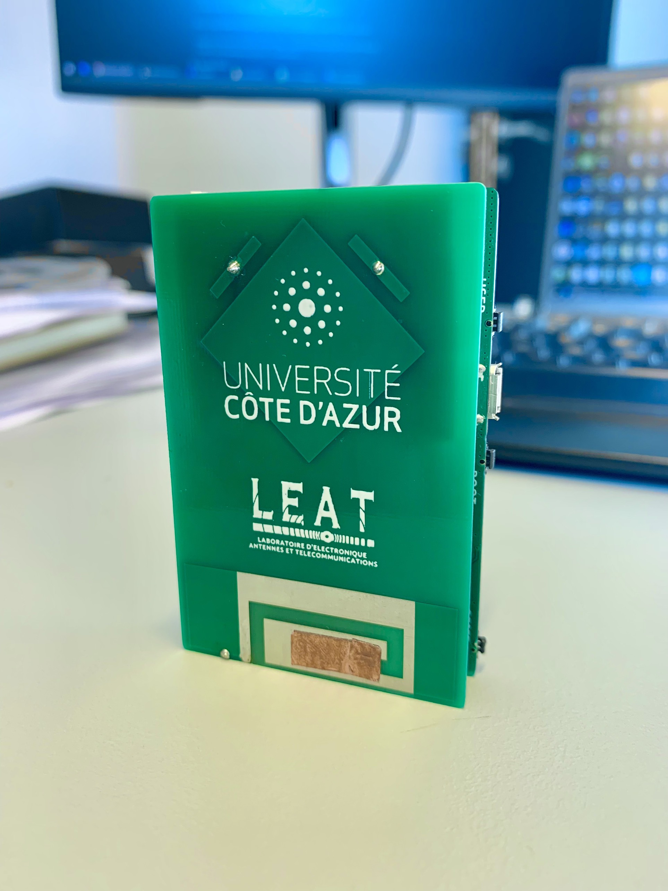
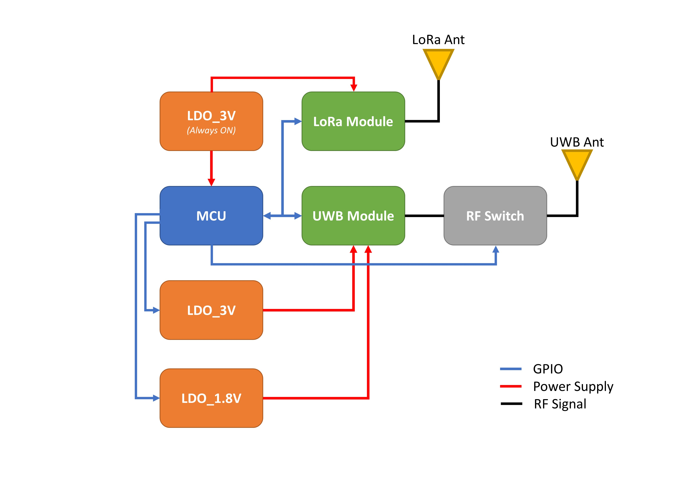
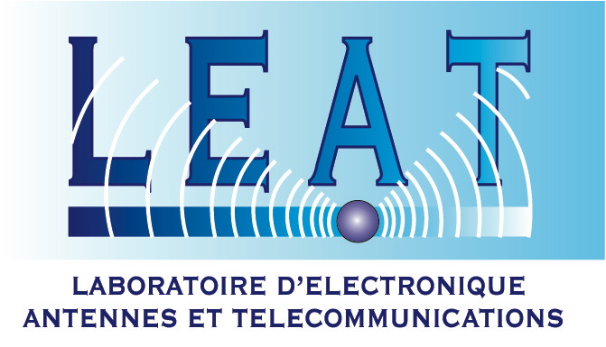

# LoRa-UWB-Core

## Supported boards

* [UCA-LEAT <b>LoRa UWB Board</b>](https://leat.univ-cotedazur.fr/)
    - MCU: [STM32L496RGT6](https://www.st.com/en/microcontrollers-microprocessors/stm32l496rg.html)
    - Ultra-wideband Module: [B-UWB-MOD1](https://www.st.com/en/wireless-connectivity/b-uwb-mod1.html)
    - LoRa Module: [E22-900M22S](https://www.ebyte.com/en/product-view-news.aspx?id=437)





## Installing

### Board Manager

 1. [Download and install the Arduino IDE](https://www.arduino.cc/en/Main/Software) (Latest Legacy IDE Recommended)
 2. Start the Arduino IDE
 3. Go into Preferences
 4. Copy & Add the following URL as an "Additional Board Manager URL"
 ```
 https://nguyenmanhthao996tn.github.io/my_files/package_uca-leat-boards_index.json
 ```
 5. Open the Boards Manager from the Tools -> Board menu and install "UCA-LEAT Boards"
 6. Select your board from the Tools -> Board menu

#### OS Specific Setup

##### Linux

<i>TODO</i>

#####  Windows

###### STM32 BOOTLOADER driver setup for Tlera Corp boards

 1. Download [Zadig](http://zadig.akeo.ie)
 2. Plugin STM32L4 board and toggle the RESET button while holding down the BOOT button
 3. Let Windows finish searching for drivers
 4. Start ```Zadig```
 5. Select ```Options -> List All Devices```
 6. Select ```STM32 BOOTLOADER``` from the device dropdown
 7. Select ```WinUSB (v6.1.7600.16385)``` as new driver
 8. Click ```Replace Driver```

## Recovering from a faulty sketch or USB disable

 Sometimes a faulty sketch can render the normal USB Serial based integration into the Arduindo IDE not working. In this case plugin the STM32L4 board and toggle the RESET button while holding down the BOOT button and program a known to be working sketch to go ack to a working USB Serial setup.


## Credits

This core is based on the [GrumpyOldPizza/arduino-STM32L4](https://github.com/GrumpyOldPizza/arduino-STM32L4)

This project is led by [<b>Amnia Benouakta</b>](mailto:Amina.Benouakta@unice.fr ) & [Prof. <b>Fabien Ferrero</b>](https://github.com/FabienFerrero) at <b>LEAT. Laboratoire d'Electronique, Antennes et Télécommunications. Université Cote d'Azur, CNRS UMR 7248.</b>




###### <i>Source code maintained by <b>mtnguyen</b>.</i>

